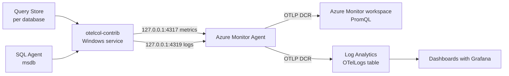

# SQL Server Query Store and SQL Agent telemetry to Azure Monitor with OpenTelemetry

This bundle deploys an OpenTelemetry Collector on a SQL Server VM that ships Query Store runtime statistics and SQL Agent job history to Azure Monitor through the local Azure Monitor Agent (AMA), plus a Grafana dashboard in Application Insights.



## What gets collected

| Source | Signal | Content | Lands in |
| --- | --- | --- | --- |
| Query Store | Logs | One record per query, plan and closed interval, with SQL text and parent procedure | `OTelLogs` |
| Query Store | Metrics | Per-procedure duration, CPU, reads; executions by type; Query Store storage | Azure Monitor workspace |
| SQL Agent | Logs | One record per job outcome and per step, with status, duration, retries and message | `OTelLogs` |
| SQL Agent | Metrics | Last duration and last-run-failed per job, runs and failures in 24h, running jobs, Agent up | Azure Monitor workspace |

Log records carry `event_source` = `mssql.querystore` or `mssql.agent`.

## Contents

| File | Where it runs | Purpose |
| --- | --- | --- |
| `deploy.config.psd1` | both | The only file you edit |
| `01-Setup-Azure.ps1` | workstation (PowerShell 7 + Azure CLI) | OTLP preview, find DCR and ApplicationId, AMA, DCR association, writes `azure-outputs.json` |
| `02-Setup-Sql.ps1` | VM (sysadmin) | Login, permissions, Query Store settings, msdb read access |
| `03-Install-Collector.ps1` | VM (admin) | Installs Collector, generates config, test run, Windows service |
| `04-Test-Pipeline.ps1` | VM (admin) | VM-side health check |
| `05-Verify-Azure.ps1` | workstation | Confirms data in Log Analytics; PromQL checks |
| `dashboards/sql-otel-grafana.json` | portal | Grafana dashboard (Query Store + Agent) |
| `dashboards/build_dashboard.py` | anywhere | Regenerates the dashboard for another workspace |
| `tools/aw2019-load.sql`, `tools/Run-AwLoad.ps1` | VM | AdventureWorks2019 procedure load generator |
| `tools/agent-demo-jobs.sql` | VM | Four demo Agent jobs (steady, flaky, failing, long-running) |
| `SQL-OTel-Deployment.ipynb` | VS Code / Jupyter | Guided walkthrough of the same steps |

## Prerequisites

- SQL Server 2017 or later on a Windows Azure VM (the scripts use 2022+ permissions when available).
- Azure CLI on your workstation, logged in with rights to create DCR associations and VM extensions.
- An Application Insights resource created in the portal with **Enable OTLP support** checked on the Basics tab. Register the preview first (step 1 does this); if the resource was created before the feature showed `Registered`, recreate it.
- Outbound HTTPS from the VM to GitHub (Collector download) and Azure Monitor.

> AMA OTLP ingestion is in preview: no SLA, not recommended for production workloads yet.

## Deployment

**1. Configure.** Edit `deploy.config.psd1`: subscription, VM, Application Insights name, databases, SQL login name, Query Store interval, and `CollectAgentJobs`.

**2. Azure setup (workstation).**

```powershell
./01-Setup-Azure.ps1
```

This prints the DCR, the Log Analytics and Azure Monitor workspaces it sends to, and writes `azure-outputs.json`. AMA opens its OTLP ports within about 15 minutes of the association.

**3. Copy the folder to the VM**, for example to `C:\otel\`, including `azure-outputs.json`.

**4. SQL setup (VM, elevated PowerShell as a sysadmin Windows login).**

```powershell
Set-ExecutionPolicy -Scope Process Bypass -Force
cd C:\otel
.\02-Setup-Sql.ps1
```

**5. Install the Collector (VM).**

```powershell
.\03-Install-Collector.ps1
```

If AMA isn't listening on 4319 yet, it installs metrics only; re-run it once `04-Test-Pipeline.ps1` shows 4319 listening. Re-running keeps tracking state, so nothing is re-sent.

**6. Verify.** On the VM run `.\04-Test-Pipeline.ps1`; on the workstation run `./05-Verify-Azure.ps1`. Every check should be `[ OK ]` and `OTelLogs` should show rows for both sources.

**7. Dashboard.** In the portal open the Application Insights resource, then **Dashboards with Grafana > New > Import**, upload `dashboards/sql-otel-grafana.json`, and pick the Azure Monitor data source. For a different workspace, regenerate it with `python dashboards/build_dashboard.py "<Log Analytics resource ID>"` using `LogAnalyticsResourceId` from `azure-outputs.json`.

**8. Optional test workload.** Run `tools/agent-demo-jobs.sql` in SSMS and `tools/Run-AwLoad.ps1 -Sessions 4` on the VM.

## Operations

- **Adding databases:** add them to `Databases`, re-run `02-Setup-Sql.ps1` then `03-Install-Collector.ps1`.
- **Freshness:** Query Store data arrives about one minute after an interval closes; Agent history within about a minute of a job finishing. For testing, `INTERVAL_LENGTH_MINUTES = 1` gives near-real-time data, but set it back afterwards.
- **Agent history retention:** the defaults (1,000 rows, 100 per job) purge quickly. The Collector reads every minute, but raise the limits if the Collector may be down for a while: `EXEC msdb.dbo.sp_set_sqlagent_properties @jobhistory_max_rows = 10000, @jobhistory_max_rows_per_job = 1000;`
- **Cardinality and cost:** metrics carry `db_name`, `object_name` and `job_name`, all bounded. `query_id` is on logs only. Metrics beyond the default guest set and log ingestion are billed.
- **Password rotation:** `02-Setup-Sql.ps1 -ResetPassword`, then `03-Install-Collector.ps1` (answer `n` to reuse).

## Troubleshooting

| Symptom | Cause | Fix |
| --- | --- | --- |
| `sc.exe` prints its usage text | Nested quotes in `binPath=` from PowerShell | The scripts use `New-Service`; don't use `sc.exe create` |
| `[::1]:4317 ... actively refused` warnings | `localhost` resolves to IPv6; AMA listens on 127.0.0.1 only | Exporters must use `127.0.0.1` (the scripts do) |
| Collector sends logs, Log Analytics has nothing | `microsoft.applicationId` set to the InstrumentationKey | Use `ApplicationId=` from the connection string (step 1 does) |
| No rows in the workspace you're querying | Logs go to the workspace in the DCR, often `DefaultWorkspace-<sub>-<region>` | Use `LogAnalyticsWorkspaceId` from `azure-outputs.json` |
| `Invalid column name 'TimeGenerated'` | Querying from the Application Insights blade | Query the Log Analytics workspace, or use `ingestion_time()` |
| 4317 listening, 4319 not | AMA hasn't loaded the logs flow yet | Wait 15 minutes, check AMA >= 1.38.1, restart AMA |
| Procedures show as `(dropped object N)` | Login can't see object metadata | `02-Setup-Sql.ps1` grants `VIEW DEFINITION` database-wide |
| Dashboard procedure panels empty | No closed intervals with procedure workload yet | Check `closed_intervals` in `04-Test-Pipeline.ps1`; run the load |
| No Agent data | Agent stopped, no jobs ran, or missing msdb grants | `04-Test-Pipeline.ps1` shows `agent_service` and `history_rows` |
| Service starts then stops | Config or storage error | Run `otelcol-contrib.exe --config config.yaml` in the foreground with `$env:MSSQL_PASSWORD` and `$env:AI_APP_ID` set |

## Known limitations

- Query Store is not real time: data appears only after its interval closes. Dynamic SQL inside a procedure is recorded as ad hoc. Executions count statements, not procedure calls.
- Agent timestamps are converted from server local time to UTC using the current offset, so runs around a daylight-saving change can be off by an hour.
- The Agent logs receiver tracks `sysjobhistory.instance_id`; history purged before the Collector reads it is lost.
- The SQL password is stored in the service's `Environment` registry value. For production, prefer a Windows account and integrated authentication.
